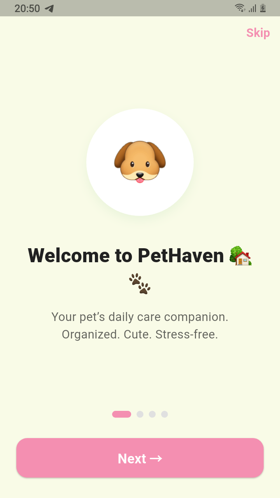
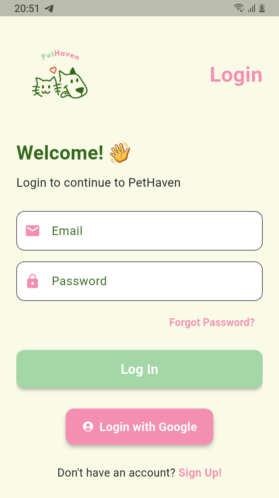
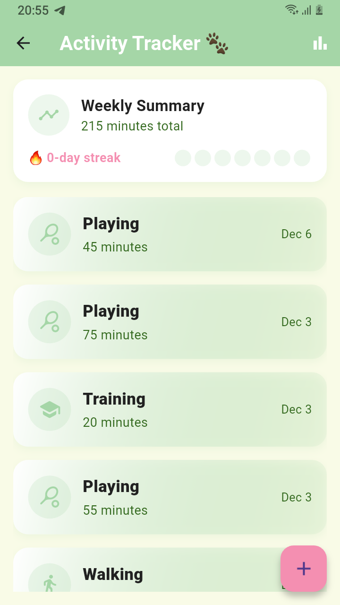

# PetHaven – Pet Care Monitoring Mobile App

PetHaven is a Flutter-based mobile application developed as a Final Year Project to help pet owners manage pet profiles, health records, medications, vaccinations, and veterinary appointments through a secure Firebase backend.

## Features
- Pet profile management
- Smart reminders
- Health record logging
- Activity tracking and analytics
- Care tips and articles
- Secure user authentication

## Technologies Used
- Flutter (Dart)
- Firebase Authentication
- Cloud Firestore
- Firebase Cloud Messaging

## Security Implementation
- Secure login using Firebase Authentication  
- Firestore security rules for protected data access  
- Strong password validation and privacy controls  
- User-specific data isolation  

## Project Type
Final Year Project – Bachelor of Computer Science (Information Security & Assurance)

## Author
**Anis Hannani**

## App Screenshots

### Onboarding

### Login

### Home Dashboard

### Pet Selection

### Pet Profile

### Activity Tracking

### Reminders

### Policy & Rules

